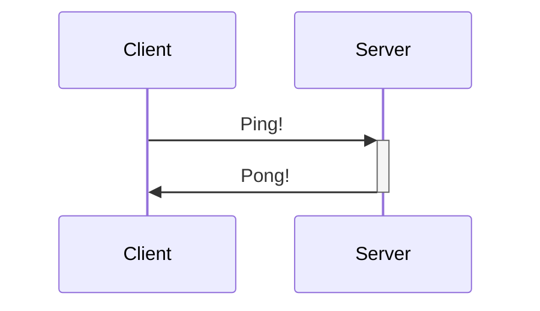

## Status Tags

- `*#edu` - Тема требующая изучения - **deprecated**
- `#WIP` (**deprecated** - то же, что и `#todo`) - в процессе написания (присутствует необработанный текст, не ставить у просто незаполненных документов)
- `#todo` (**deprecated** - ставится просто комментарий с `TODO:`) - есть недоделаные части, в основном ставится у вопросов, которые я не смог обработать. Более конкретные чем WIP, касается более конкретных вопросом, тема которых уже была предварительно обработана.

## Tags

- `#support` - тег для служебных заметок, хранят описание чего-либо в программе, не относятся к центральным темам;
- `#context` - тег контекста, одна из целей документа - погрузится в контекст области, что бы можно было начать работать по теме. Быстрее восстановить компетенции работы с чем-то.
- **REVISION** `#CS` / computer science - фундаментальная теория, must have знания;
- `#OOP` - Объектно ориентированное программирование, фундаментальные понятия и теория;

## Syntax

- to-do
- [/] incomplete
- done
- [-] canceled
- [>] forwarded
- [<] scheduling
- [?] question
- [!] important
- [\*] star
- ["] quote
- [l] location
- [b] bookmark
- [i] information
- [S] savings
- [I] idea
- [p] pros
- [c] cons
- [f] fire
- [k] key
- [w] win
- [u] up
- [d] down
- [D] draft pull request
- [P] open pull request
- [M] merged pull request

### Сноски

#### Базовые

> [!NOTE]:br
> Highlights information that users should take into account, even when skimming.

> [!TIP]
> Optional information to help a user be more successful.

> [!IMPORTANT]:br
> Crucial information necessary for users to succeed.

> [!WARNING]:br
> Critical content demanding immediate user attention due to potential risks.

> [!CAUTION]
> Negative potential consequences of an action.

#### Все

> [!example]
>
> > [!todo]
> >
> > > [!info]
> > >
> > > > [!note]
> > > >
> > > > > [!bug]

> [!abstract] abstract, summary, tldr

> [!tip] tip, hint, important

> [!success] success, check, done

> [!warning] warning, caution, attention

> [!fail] fail, failure, missing

> [!error] error, danger

> [!question] question, help, faq

> [!quote] quote, cite

# Plugins

## Mermaid, C4

```markdown
[comment]: <hyperlink> Some text
[comment]: #hyperlink Some text
```



*Синтаксис*: Любая диаграмма в начале объявляется через задекларированное имя типа диаграммы. Допустимые типы:

- **Flowchart (graph)** -
- **Sequence diagram (sequenceDiagram)** -
- **Gantt diagram (gantt)** -
- **Class diagram (classDiagram)** -
- **Git graph (gitGraph)** -
- **Entity Relationship Diagram (erDiagram)** -
- **User Journej Diagram (journey)** -
- **Quadrant Chart (quadrantChart)** -
- **XY Chart (xychart-beta)** -

## Base

```base
views:
  - type: table
    name: Table
    filters:
      or:
        - file.hasTag("support")
        - file.hasTag("workspace")
    order:
      - file.name
      - file.mtime
    sort:
      - property: file.mtime
        direction: ASC

```
