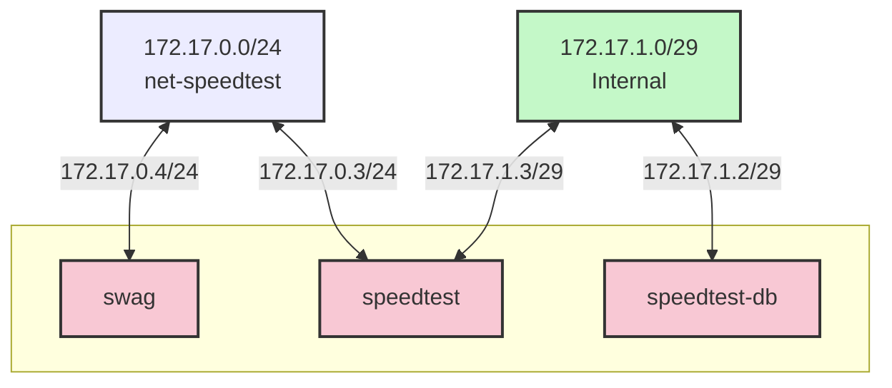

## Networking

Docker have a lots of different types:

- none - отсутствие
- host - подключить контейнер напрямую к машине
- macvlan - виртуальный адатер на машине с собственными ip и mac для каждого контейнера. Так контейнеры выглядят в сети как отдельные машины.
- ipvlan - виртуальный адатер на машине с собственным ip, но единым mac для всех контейнеров
- overlay - распределенная сеть между несколькими узлами docker swarm
- bridge (default) - встроенный сетевой мост, докер пропускает трафик из/в хост машину
- bridge (user-defined) - кастомный сетевой мост, докер будет пропускать травик из/в хост машины.

### Inter-Container Communication

DNS - важная фича кастомных мостов, если у нас есть контейнер `speedtest` и `speedtest-db`, работающие по `net-speedtest`, то мы можем указать `speedtest` подключаться к бд используя `speedtest-db:5432`, а не напрямую писать адрес и expose порт. Так же можно контролировать размер сети, независимо от lan/wan сети. Дополнительно, с кастомный мостом не нужно беспокоится о портах, т.к. контейнеры распределяться по ip, и все могут использовать один порт, например 80.

```yaml
services:
	speedtest:
	image: ...
	networks:
		- net-speedtest
		- private

	speedtest-db:
		image: ...
		networks:
			- private

	swag:
		image: lscr.io/linuxserver/swag:latest
		container_name: swag
		networks:
			- net-speedtest
		ports:
			- 443:443
			- 80:80

networks:
	net-speedtest:
		name: net-speedtest
		ipam:
			config:
				- subnet: 172.17.0.0/24 # 172.17.0.1 - 172.17.0.254
	private:
		name: private
		internal: true
		ipam:
			config:
				- subnet: 172.17.1.0/29 # 172.17.1.1 - 172.20.1.6
```

Сейчас топология сети выгляди так:


