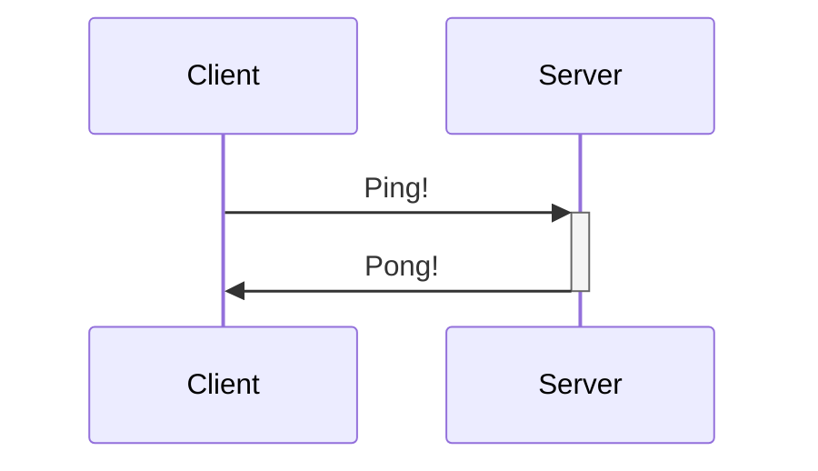

hello world!


```sql
SELECT * FROM users GROUP BY count HAVING count > 10
```

<p>hello world</p>

```html
<div class="flex items-center">
  <div class="card bg-base-200 rounded-full">
    <h1 class="text-xl text-base-content">{ page.title }</h1>
    <p class="text-prose text-sm text-base-content/40">{ page.description }</p>
  </div>
</div>
```


## Syntax
- [ ] to-do
- [/] incomplete
- [x] done
- [-] canceled
- [>] forwarded
- [<] scheduling

- [?] question
- [!] important
- [*] star
- ["] quote
- [l] location
- [b] bookmark
- [i] information
- [S] savings
- [I] idea
- [p] pros
- [c] cons
- [f] fire
- [k] key
- [w] win
- [u] up
- [d] down
- [D] draft pull request
- [P] open pull request
- [M] merged pull request


### Сноски
#### Базовые
> [!NOTE]  
> Highlights information that users should take into account, even when skimming.

> [!TIP]
> Optional information to help a user be more successful.

> [!IMPORTANT]  
> Crucial information necessary for users to succeed.

> [!WARNING]  
> Critical content demanding immediate user attention due to potential risks.

> [!CAUTION]
> Negative potential consequences of an action.

#### Все
> [!example]
> > [!todo]
> > > [!info]
> > > > [!note] 
> > > > > [!bug]


> [!abstract] abstract, summary, tldr

> [!tip] tip, hint, important

> [!success] success, check, done

> [!warning] warning, caution, attention

> [!fail] fail, failure, missing

> [!error] error, danger

> [!question] question, help, faq

> [!quote] quote, cite


# Plugins
## Mermaid, C4

```markdown
[comment]: <hyperlink> Some text
[comment]: #hyperlink Some text
```



*Синтаксис*: Любая диаграмма в начале объявляется через задекларированное имя типа диаграммы. Допустимые типы:
* **Flowchart (graph)** - 
* **Sequence diagram (sequenceDiagram)** - 
* **Gantt diagram (gantt)** - 
* **Class diagram (classDiagram)** - 
* **Git graph (gitGraph)** - 
* **Entity Relationship Diagram (erDiagram)** - 
* **User Journej Diagram (journey)** - 
* **Quadrant Chart (quadrantChart)** - 
* **XY Chart (xychart-beta)** - 


